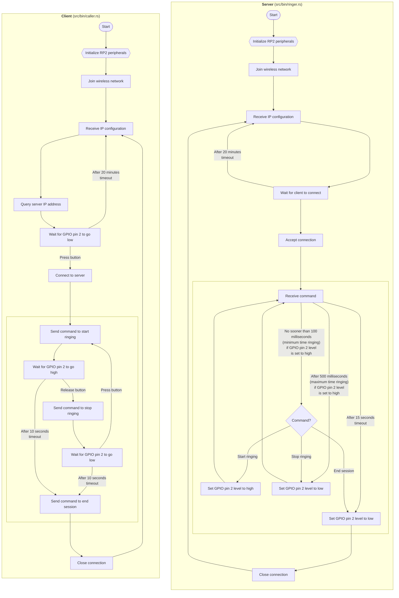

## About immerbell

A wireless doorbell application that explores the asynchronous embedded Rust ecosystem and targets Raspberry Pi Pico microcontrollers, using the first release of the Embassy framework and its crates that support the stable Rust toolchain.

> Installation details are available on this project's Hackaday page at https://hackaday.io/project/195922

Some examples of asynchronous functions used:
* The _caller_ device, when idle, awaits at [`Input::wait_for_low`](https://docs.embassy.dev/embassy-rp/git/rp2040/gpio/struct.Input.html#method.wait_for_low) in its worker loop, in `notify_task`
* The _ringer_ device, when idle, awaits at [`TcpSocket::accept`](https://docs.embassy.dev/embassy-net/git/default/tcp/struct.TcpSocket.html#method.accept) in its worker loop, in `listen_task`
* Meanwhile, in `led_task`, the actor design pattern is used and [`Signal::wait`](https://docs.embassy.dev/embassy-sync/git/default/signal/struct.Signal.html#method.wait) is awaited

### Time-aware futures

The application uses [`join`](https://docs.embassy.dev/embassy-futures/git/default/join/fn.join.html), [`select`](https://docs.embassy.dev/embassy-futures/git/default/select/fn.select.html), and [`with_timeout`](https://docs.embassy.dev/embassy-time/git/default/fn.with_timeout.html) extensively:
* While waiting for network operations to complete, [`TimeoutError`](https://docs.embassy.dev/embassy-time/git/default/struct.TimeoutError.html) is handled along with other possible errors
* While waiting for a signal to set the blinking pattern, toggling the LED state is done using `select` with [`Timer::after`](https://docs.embassy.dev/embassy-time/git/default/struct.Timer.html#method.after)
* For having a lower and upper limit on the duration of continuous ringing
    * As the doorbell button is pressed, `join` with `Timer::after` ensures a minimum amount of time spent ringing
    * While waiting the for the button to be released, `select` with `Timer::after` cuts off ringing if held for too long

### Network sessions

The _caller_ device, when idle, and the doorbell button is pressed, establishes a connection with the _ringer_ device over TCP, and this connection is kept alive until 10 seconds after the button was last pressed or released.
During this period of activity, commands for starting and stopping the ringing, followed by a final command to end the session and return to an idle state, are transferred one byte at a time:

The commands are encoded as `0x00` for stopping the ringing, circuits open, `0x01` for starting the ringing, circuits closed, and `0xFF` for the devices going idle.

### Device discovery

In the current setup, the devices join an existing wireless network so that they can be installed farther apart than if the _ringer_ device were also the wireless access point.
Knowing the remote hostname, the _caller_ makes a [`Stack::dns_query`](https://docs.embassy.dev/embassy-net/git/default/struct.Stack.html#method.dns_query), and with configuration that the devices receive after joining the local area network, the device IP addresses are available on request.

With the remote IP address known, and the port number that the _ringer_ device is listening on agreed upon in advance, starting a new session is instantaneous.

The devices renew this information every 20 minutes as they are starting their worker loops.
 
## Control flow

